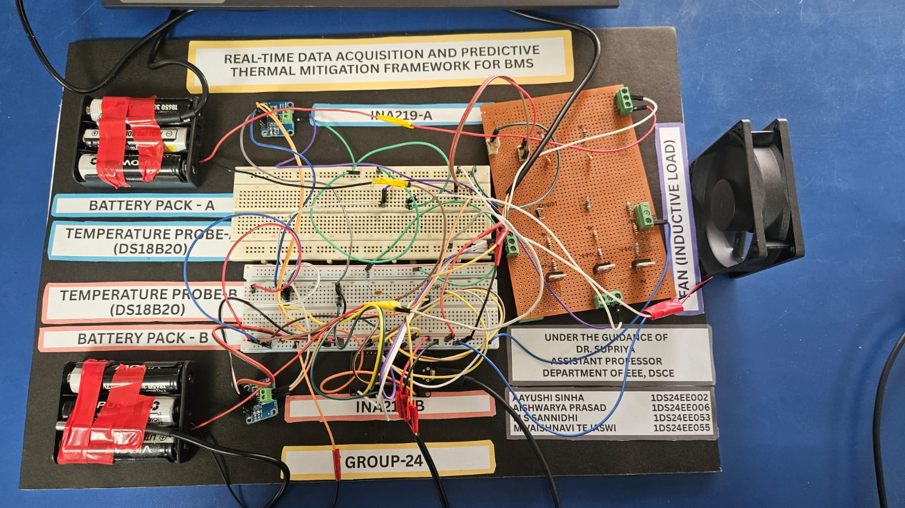
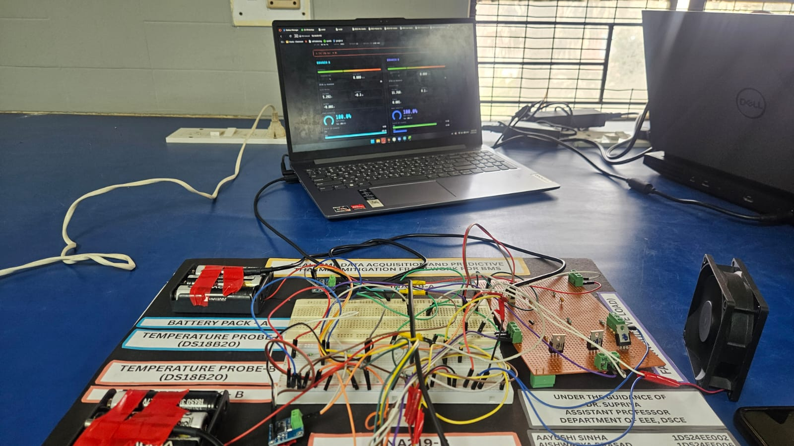

# Hardware Architecture & Circuitry

This document details the physical layer and wiring specifications for the Adaptive BMS framework.

## 1. Physical Prototype
Below is the physical implementation of the dual-branch monitoring system.

*Figure 1: ESP32-based BESS Prototype with independent INA219 and DS18B20 sensing nodes.*

## 2. Pin Mapping (ESP32)

| Component | ESP32 GPIO | Protocol | Description |
| :--- | :--- | :--- | :--- |
| **DS18B20 Probes** | GPIO 5 | 1-Wire | Dual-probe thermal bus (requires 4.7k pull-up) |
| **INA219 (Branch A)**| GPIO 21 (SDA), 22 (SCL)| I2C (0x40) | High-side Voltage/Current sensing |
| **INA219 (Branch B)**| GPIO 21 (SDA), 22 (SCL)| I2C (0x41) | Soldered A0 bridge for independent addressing |
| **MOSFET Branch A** | GPIO 19 | PWM | IRLZ44N Logic-level switching (5kHz) |
| **MOSFET Branch B** | GPIO 23 | PWM | IRLZ44N Logic-level switching (5kHz) |

## 3. Circuit Innovation
The hardware utilizes a **Star-Grounding** architecture to minimize electrical noise during high-frequency PWM switching. This ensures the Kalman Filter receives clean data from the INA219 sensors.

### Key Hardware Features:
*   **Predictive Throttling:** Logic-level MOSFETs allow the system to reduce current via Pulse Width Modulation rather than simple mechanical relay disconnection.
*   **Redundancy:** Dual-branch 3S2P configuration allows for "Branch Isolation" where one string can be throttled while the other maintains system power.
*   **High-Gain Data Link:** Utilizes external 5.8dBi and Moxon antennas to maintain 99.8% IoT uptime in high-interference environments.

## 4. Real-Time Visualization
The dashboard displays the telemetry from the sensors listed above in sub-second intervals via a local WebSocket server.

